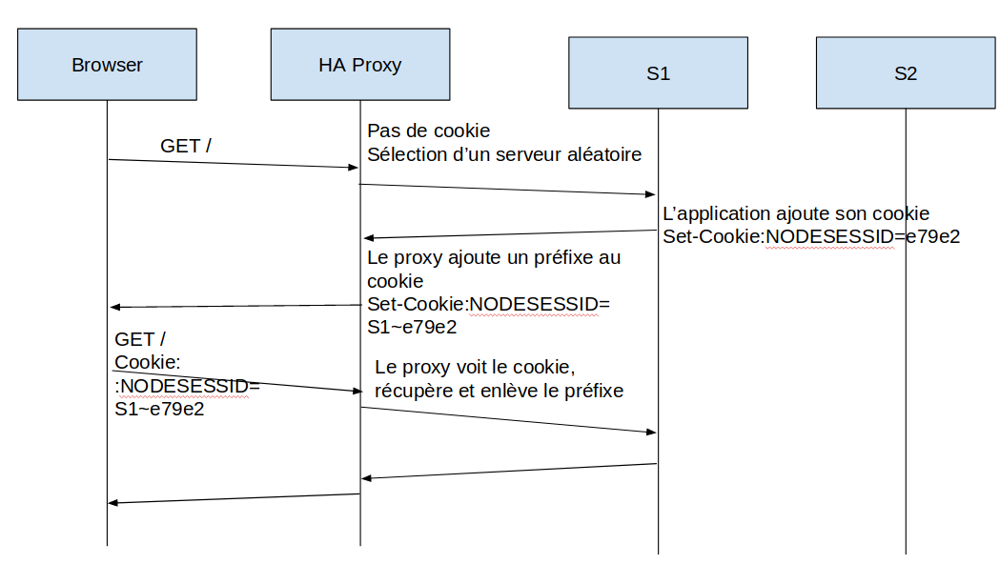

# Laboratoire 3 - Load Balancing

## Auteurs : Daniel Oliveira Paiva et Edin Mujkanovic

# Task 1

*1 . Explain how the load balancer behaves when you open and refresh the URL <http://192.168.42.42> in your browser. Add screenshots to complement your explanations. We expect that you take a deeper a look at session management.*

La première requête nous envoie sur le serveur s2 et si nous rafraîchissons la page, nous arrivons sur le serveur s1. Après plusieurs rafraîchissements de la page web, nous pouvons remarquer que nous changeons de serveur. 


Actuellement, nous avons un cookie "NODESESSID" qui correspond à un numéro de session. Nous pouvons nous apercevoir qu'il envoie à chaque requête son numéro de session mais que le serveur redéfini son id de session. Du coup, la session n'est pas préservé entre chaque requête.


*<u>2. Explain what should be the correct behavior of the load balancer for session management.*</u>

Le comportement correct d'un load balancer concernant la gestion de session est de renvoyé un client toujours sur le même serveur. En effet, ainsi la session est maintenue. 
Prenons un exemple concret:
Si un utilisateur se connecte sur un site de e-commerce et rajoute un article dans le panier, et que en rajoutant un deuxième article, il est redirigé vers un autre serveur, le premier article sera perdu.
En redirigeant le serveur sur le même serveur, ce problème ne surviendrait pas et le panier serait toujours le même.


*3. Provide a sequence diagram to explain what is happening when one requests the URL for the first time and then refreshes the page. We want to see what is happening with the cookie. We want to see the sequence of messages exchanged (1) between the browser and HAProxy and (2) between HAProxy and the nodes S1 and S2.*

*4. Provide a screenshot of the summary report from JMeter.*

Nous pouvons remarquer, comme expliqué au point 1, que le load balancer distribue les requêtes uniformément à chaque serveur.


*5. Run the following command:*

```bash
$ docker stop s1
```

*Clear the results in JMeter and re-run the test plan. Explain what is happening when only one node remains active. Provide another sequence diagram using the same model as the previous one.*

La performance est grandement impacté car le load balancer va tenter d'atteindre le serveur éteint. 


# Task 2

*1. There is different way to implement the sticky session. One possibility  is to use the SERVERID provided by HAProxy. Another way is to use the  NODESESSID provided by the application. Briefly explain the difference  between both approaches (provide a sequence diagram with cookies to show the difference).*





Comme le montre les deux diagrammes ci-dessus, le protocole est assez similaire. Lors de l'utilisation de SERVERID par le load balancer, le load balancer choisit un serveur et lui envoie la requête. Lorsque le load balancer recevra une requête son le cookie SERVERID, le load balancer va le set avec l'identifiant du serveur répondant à la requête. Toute requête effectuée avec le cookie SERVERID sera ensuite distribuée sur le serveur correspondant au serveur.


Lors de l'utilisation de NODESESSID par l'application, le load balancer va se comporter de la même manière lors de la première requête. Il va envoyer la requête à un des serveurs disponible et attendre la retour de la requête pour mettre l'identifiant du serveur. Néanmoins, le cookie va être set par l'application et le load balancer va ajouter à la fin du cookie un point plus l'identifiant du serveur. Lors d'une requête de l'utilisateur, le load balancer va récupérer le cookie, enlever sa partie et forwarder la requête au serveur correspondant.

2. *Provide the modified `haproxy.cfg` file with a short explanation of the modifications you did to enable sticky session management.*

Les lignes suivantes ont été ajoutées : 

```
backend nodes
   cookie SERVERID insert indirect
   server s1 ${WEBAPP_1_IP}:3000 cookie s1 check
   server s2 ${WEBAPP_2_IP}:3000 cookie s2 check
```

La ligne `server [servername] [serverIP]:[serverPort] cookie [servername] check` permet de définir la valeur du cookie pour le serveur spécifié.

La ligne `cookie SERVERID insert indirect` permet de spécifié à HAProxy de rajouter un cookie SERVERID aux réponse des serveur ce qui lui permettra de rediriger les prochaines requêtes sur le bon serveur

3. *Explain what is the behavior when you open and refresh the URL http://192.168.42.42 in your browser. Add screenshots to complement your explanations. We expect that you take a deeper a look at session management.*

On peut s'apercevoir que le serveur est toujours le même. En effet, le cookie SERVERID a été ajoutée avec la valeur s1. La variable sessionViews va s'incrémenter en fonction du nombre de page chargée avec la session.


4. Provide a sequence diagram to explain what is happening when one requests the URL for the first time and then refreshes the page. We want to see what is happening with the cookie. We want to see the sequence of messages exchanged (1) between the browser and HAProxy and (2) between HAProxy and the nodes S1 and S2. We also want to see what is happening when a second browser is used.


La différence principale entre le premier et le deuxième naviguateur est que étant donné que le proxy est configuré en "Round Robin" et que le premier navigateur communique avec le serveur S1, la requête du deuxième naviguateur sera automatiquement redirigée sur le serveur 2, qui n'a pas eu encore de requête.


5. *Provide a screenshot of JMeter's summary report. Is there a difference with this run and the run of Task 1?*

Les résultats du test JMeter confortent l'idée que le load balancer fonctionne correctement. En effet, chaque requête faite par le même utilisateur est redirigé sur le même serveur à chaque fois. Lors de la tâche 1, chaque requête était envoyé sur un serveur différent.


6. *Provide a screenshot of JMeter's summary report. Give a short explanation of what the load balancer is doing.*

Lors de la requête du premier thread, le load balancer va lui attribuer un serveur (s1 par exemple) et le deuxième thread va se voir attribuer l'autre serveur à cause du mode Round Robin (s2 dans l'exemple). Chaque thread va alors faire 1000 requêtes sur chaque serveur.


# TASK 3

1. Take a screenshot of the Step 5 and tell us which node is answering.

   [](https://github.com/oTwoWin/Teaching-HEIGVD-AIT-2019-Labo-Load-Balancing/blob/master/Documentation/images/dwq.jpeg)

   On peut s'apercevoir que le node s1 est celui qui répond.

2. Based on your previous answer, set the node in DRAIN mode. Take a screenshot of the HAProxy state page.

   [](https://github.com/oTwoWin/Teaching-HEIGVD-AIT-2019-Labo-Load-Balancing/blob/master/Documentation/images/image-20191125130018656.png)

   Le node s1 est passé en bleu maintenant.

3. Refresh your browser and explain what is happening. Tell us if you stay on the same node or not. If yes, why? If no, why?

   Lors du rafraîchissement de la page, on reste toujours sur le même serveur. En effet, tout le trafic qui est déjà dirigé sur le serveur va le rester. Le reste de celui-ci devrait aller sur l'autre serveur.

4. Open another browser and open `http://192.168.42.42`. What is happening?

   La requête est redirigé sur le node s2. C'est le comportement normal du Round robin.

5. Clear the cookies on the new browser and repeat these two steps multiple times. What is happening? Are you reaching the node in DRAIN mode?

   Le serveur s1 n'est jamais atteint en mode DRAIN. En effet, à chaque nouvelle session, le serveur va nous rediriger sur le serveur s2.

6. Reset the node in READY mode. Repeat the three previous steps and explain what is happening. Provide a screenshot of HAProxy's stats page.

   Le navigateur maintient toujours la connection sur le node s1. Ensuite à l'ouverture d'un nouvelle session, le load balancer va se comporter normalement. Il va switcher entre s1 et s2 à chaque nouvelle session.

   [](https://github.com/oTwoWin/Teaching-HEIGVD-AIT-2019-Labo-Load-Balancing/blob/master/Documentation/images/image-20191125133714561.png)

7. Finally, set the node in MAINT mode. Redo the three same steps and explain what is happening. Provide a screenshot of HAProxy's stats page.

   Toutes les connexions sont directement redirigées sur le serveur s2, même les sessions déjà active sur s1. Le serveur s1 n'est plus jamais atteint tant qu'il est en mode MAINT.

   [](https://github.com/oTwoWin/Teaching-HEIGVD-AIT-2019-Labo-Load-Balancing/blob/master/Documentation/images/image-20191125134126274.png)

​	

# Task 4

1. Be sure the delay is of 0 milliseconds is set on `s1`. Do a run to have base data to compare with the next experiments.

   Nous avons tout d'abord récuperer l'adresse IP de `s1` avec la commande : 

   `docker inspect s1 | grep IPAddress`    

   Cette commande nous a indiqué que `s1` a comme adresse IP `192.168.42.11`

   Pour mettre le délai à 0 millisecondes, nous avons executé la commande donnée dans l'énoncé : 

   `curl -H "Content-Type: application/json" -X POST -d '{"delay": 0}' http://192.168.42.11:3000/delay`

   Cette commande a bien modifié le délai : 

   

   Nous avons ensuite, comme demandé, executé un JMeter afin d'avoir des données de base : 

   

   Nous pouvons remarquer que les requêtes sont uniformement distrubuées entre les deux serveurs web.

2. Set a delay of 250 milliseconds on `s1`. Relaunch a run with the JMeter script and explain what it is happening?

   Afin de mettre le nouveau délai, nous avons executé la commande :

   `curl -H "Content-Type: application/json" -X POST -d '{"delay": 250}' http://192.168.42.11:3000/delay`

   La commande a bien fonctionné : 

   

   Nous avons relancé les tests et voici les résultats : 

   Nous pouvons remarquer que toutes les requêtes ont bien été effectuées  mais que le délai a un impact majeur sur le serveur `s1`. En effet, dans les résultats précédents (question 1), nous pouvons remarquer que le serveur `s1` a un débit de 127.3/sec mais dans les résultats listés ci-dessus, le débit est descendu à 3.3/sec. Cette baisse est dûe au délai augmenté.

   

3. Set a delay of 2500 milliseconds on `s1`. Same than previous step.

   Afin de mettre le nouveau délai, nous avons executé la commande :

   `curl -H "Content-Type: application/json" -X POST -d '{"delay": 2500}' http://192.168.42.11:3000/delay`

   La commande a bien fonctionné : 

   

   Nous avons relancé les tests et voici les résultats : 

   Nous pouvons remarquer que le délai de 2500 millisecondes à un impact majeur sur le serveur `s1`. En effet, ce dernier ne recevera quasiment plus aucune requête et toutes les requêtes seront redirigées sur le serveur `s2`. Nous nous sommes demandés pourquoi toutes les requêtes étaient redirigées sur le serveur `s2` alors nous nous sommes connectés à l'interface administrative du proxy, situé à l'adresse `http://192.168.42.42:1936/` et nous avons remarqué que le serveur `s1` est considéré par le proxy comme `down` : 

   

   En effet, le proxy le considère comme down si le temps de réponse est beaucoup trop bas.

4. In the two previous steps, are there any error? Why?

   Non, nous n'avons obtenu aucune erreur. En effet, toutes les requêtes ont été effectuées correctement mais durant la deuxième étape, les requêtes ont été majoritairement redirigées sur `s2` car le proxy considerait le serveur `s1` comme n'étant plus disponible. Nous pouvons remarquer également que le `proxy` a bien fait son travail en redirigeant les requêtes sur le serveur 2 en cas d'indisponibilité du serveur 1.

5. Update the HAProxy configuration to add a weight to your nodes. For that, add `weight [1-256]` where the value of weight is between the two values (inclusive). Set `s1` to 2 and `s2` to 1. Redo a run with 250ms delay.

   Nous avons tout d'abord modifié le fichier de configuration `haproxy.cfg` comme ceci : 

   

   Nous avons ensuite éteins l'infrastructure et remonter afin que cette dernière prenne en compte la modification du fichier de configuration.

   Nous avons ensuite définit le nouveau délai de `250ms` sur le serveur `s1` : 

   

   

   Voici les résultats obtenus sur le logiciel `Jmeter` :

   

   Nous pouvons remarquer que le poids n'a eu aucune influence sur la distribution des paquets. En effet, étant donné que les sessions sont toujours preservées, et que nous avons simulé deux utilisateurs faisant chacun 1000 requêtes, ces dernières seront redirigées sur le même serveur. 

   Par contre, si nous mettons une configurations de 3 utilisateurs avec 100 requêtes chacun, nous pouvons remarquer que les requêtes sont distribuées selon le poids :

   

   

6. Now, what happened when the cookies are cleared between each requests and the delay is set to 250ms ? We expect just one or two sentence to summarize your observations of the behavior with/without cookies.

   La configuration du test est de **2 utilisateurs **faisant chacun **100 requêtes**.

   Voici les résultats obtenus avec et sans cookies : 

   **Avec cookies:**

   

   **Sans cookies:**

   

   Nous pouvons remarquer que sans les cookies, les requêtes sont distribuées selon les poids accordés, 2 pour le `s1` et 1 pour le `s2`. Par contre, avec les cookies, les requêtes sont réparties à moitié sur le `s1` et l'autre moitié sur `s2`. Ce comportement est dû au fait que les cookies sont présents et que lorsque le premier utilisateur va se connecter et s'il est redirigé sur le `s1`, toutes ces futures requêtes seront redirigées sur le `s1`, indépendamment du poids. Ce comportement est identique avec le deuxième utilisateur, mais sur `s2`.


# Task 5

Pour cette partie du laboratoire, il nous est demandé de découvrir `HAProxy` et de prendre deux stratégies différentes afin de les analyser grâce à l'outil `JMeter`. Après avoir lu les différentes stratégies, nous avons choisi les stratégies **first** et **leastconn**. Nous traiterons différents cas que nous analyserons et dont on tirera une conclusions.

### 1. Configurations de HAProxy

#### 1.1 Stratégie *first*

La stratégie **first** consiste à redirigé la requête entrante sur le premier serveur ayant des connexions disponibles. Si deux serveurs ont le même nombre de connexion disponible, le proxy choisira l'id du serveur le plus faible. Le nombre maximum de connexion par serveur est défini dans le fichier de configuration `haproxycfg`.

Afin de configurer *HAProxy* avec la stratégie *first*, nous avons dû la spécifier dans le fichier de configuration *haproxy.cfg* mais nous avons dû également spécifier le nombre de connexions maximum simultanées sur chaque serveur. Nous avons décidé de mettre ce nombre à 5.

Ci-dessous, une partie du fichier haproxy.cfg contenant les modifiations


#### 1.2 Stratégie *leastconn*

La stratégie **leastconn** a plutôt une idéologie inverse de **first**. La requête va être redirigée sur le serveur ayant le moins de connexions en cours. Si plusieurs serveurs ont le même nombre de connexions en cours, l'algorithme Round-Robin est utilisé. Il est idéal pour de longues connexions.  

Afin de configurer *HAProxy* avec la stratégie *fleastconn*, nous avons dû la spécifier dans le fichier de configuration *haproxy.cfg* 

Ci-dessous, une partie du fichier haproxy.cfg contenant les modifications:


### 2. 1er test 

#### 1.1 Configurations des serveurs

- 0 ms sur les deux serveurs

  

#### 1.2 Configurations de JMeters

- 50 utilisateurs (threads)

- 100 requêtes chacuns

- Cookies activés 

  

#### 1.3 Résultats Jmeters

##### 		**first**:		

Nous pouvons remarquer qu'avec la stratégie **first** et les cookies activés , la distribution se fait uniformement sur les deux serveurs. La distrbutions se fera ainsi : 

- Le serveur `s1` se verra attribués jusqu'à ce qu'il ait 5 connexions actives. Lorsque la 6ème requête arrive, le proxy redirigera cette dernière sur le serveur `s2`.

##### 		

**leastconn**:


### 2. 2ème test 

#### 1.1 Configurations des serveurs

- 0 ms sur les deux serveurs

  

#### 1.2 Configurations de JMeters

- 50 utilisateurs (threads)

- 100 requêtes chacuns

- Cookies désactivés 

  

#### 1.3 Résultats Jmeters

##### 		**first**:

Dans ce test, la seule différence est que les cookies sont désactivés. Nous pouvons remarqués que plus de la moitiés des requêtes ont été redirigées sur le serveur `s1`. En d'autres termes, nous pouvons dire que 2285 requêtes sont arrivées au proxy lorsque le serveur `s1` avait déjà 5 connexions actives.


**leastconn**:


### 3. 3ème test 

#### 1.1 Configurations des serveurs

- 200ms pour le serveur `s1`

- 50ms pour le serveur `s2`

  

#### 1.2 Configurations de JMeters

- 50 utilisateurs (threads)

- 10 requêtes chacuns

- Cookies activés 

  

#### 1.3 Résultats Jmeters

##### 		**first**:

Dans ce test, les cookies sont activés, le délai est quatre fois supérieur sur le `s1` que sur le `s2` et 500 requêtes au total. Nous pouvons remarqué que le serveur `s2` va receptionner la majorité des requêtes. Une autre manière d'interépreter ces résultats et que 15 utilisateurs (150 requêtes / 10 requêtes) ont fait des requêtes lorsque le serveur `s2` avait 5 connexions déjà actives.


**leastconn**:


### 4. 4ème test 

#### 1.1 Configurations des serveurs

- 200ms pour le serveur `s1`

- 50ms pour le serveur `s2`

  

#### 1.2 Configurations de JMeters

- 50 utilisateurs (threads)

- 10 requêtes chacuns

- Cookies désactivés 

  

#### 1.3 Résultats Jmeters

##### 		**first**:

Ce test est identique au précédent sauf qu'il n'y a pas de cookies. Et dans ce cas là, nous pouvons remarquer que le serveur `s2` receptionne encore plus de requêtes. Une autre manière d'interpreter ce résultat et que 105 requêtes sont arrivées lorsque le serveur `s2` avait 5 connexions déjà actives.


**leastconn**:


