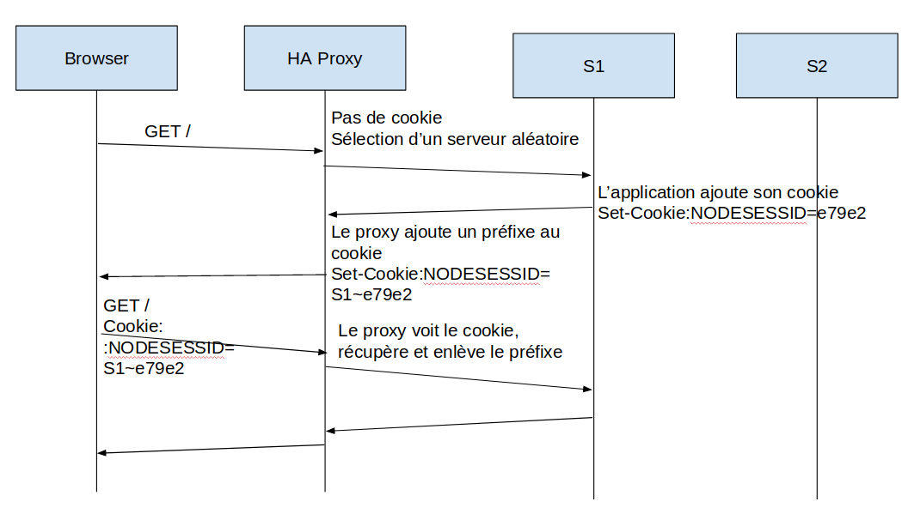
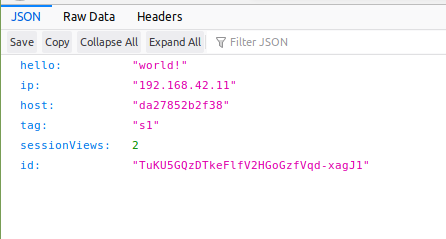
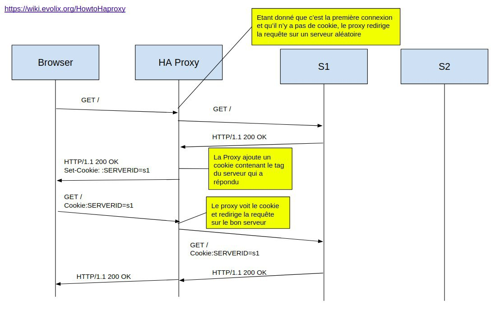
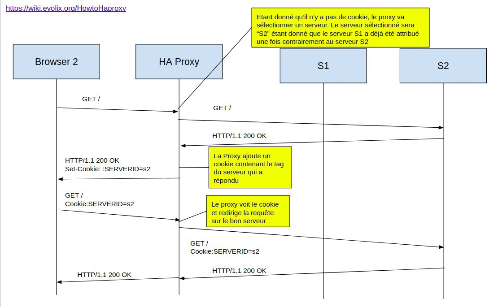
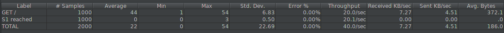

# Task 2: Sticky sessions

*1. There is different way to implement the sticky session. One possibility  is to use the SERVERID provided by HAProxy. Another way is to use the  NODESESSID provided by the application. Briefly explain the difference  between both approaches (provide a sequence diagram with cookies to show the difference).*





Comme le montre les deux diagrammes ci-dessus, le protocole est assez similaire. Lors de l'utilisation de SERVERID par le load balancer, le load balancer choisit un serveur et lui envoie la requête. Lorsque le load balancer recevra une requête son le cookie SERVERID, le load balancer va le set avec l'identifiant du serveur répondant à la requête. Toute requête effectuée avec le cookie SERVERID sera ensuite distribuée sur le serveur correspondant au serveur.


Lors de l'utilisation de NODESESSID par l'application, le load balancer va se comporter de la même manière lors de la première requête. Il va envoyer la requête à un des serveurs disponible et attendre la retour de la requête pour mettre l'identifiant du serveur. Néanmoins, le cookie va être set par l'application et le load balancer va ajouter à la fin du cookie un point plus l'identifiant du serveur. Lors d'une requête de l'utilisateur, le load balancer va récupérer le cookie, enlever sa partie et forwarder la requête au serveur correspondant.

2. *Provide the modified `haproxy.cfg` file with a short explanation of the modifications you did to enable sticky session management.*

Les lignes suivantes ont été ajoutées : 

```
backend nodes
   cookie SERVERID insert indirect
   server s1 ${WEBAPP_1_IP}:3000 cookie s1 check
   server s2 ${WEBAPP_2_IP}:3000 cookie s2 check
```

La ligne `server [servername] [serverIP]:[serverPort] cookie [servername] check` permet de définir la valeur du cookie pour le serveur spécifié.

La ligne `cookie SERVERID insert indirect` permet de spécifié à HAProxy de rajouter un cookie SERVERID aux réponse des serveur ce qui lui permettra de rediriger les prochaines requêtes sur le bon serveur

3. *Explain what is the behavior when you open and refresh the URL http://192.168.42.42 in your browser. Add screenshots to complement your explanations. We expect that you take a deeper a look at session management.*

On peut s'apercevoir que le serveur est toujours le même. En effet, le cookie SERVERID a été ajoutée avec la valeur s1. La variable sessionViews va s'incrémenter en fonction du nombre de page chargée avec la session.





4. Provide a sequence diagram to explain what is happening when one requests the URL for the first time and then refreshes the page. We want to see what is happening with the cookie. We want to see the sequence of messages exchanged (1) between the browser and HAProxy and (2) between HAProxy and the nodes S1 and S2. We also want to see what is happening when a second browser is used.





La différence principale entre le premier et le deuxième naviguateur est que étant donné que le proxy est configuré en "Round Robin" et que le premier navigateur communique avec le serveur S1, la requête du deuxième naviguateur sera automatiquement redirigée sur le serveur 2, qui n'a pas eu encore de requête.


5. *Provide a screenshot of JMeter's summary report. Is there a difference with this run and the run of Task 1?*

Les résultats du test JMeter confortent l'idée que le load balancer fonctionne correctement. En effet, chaque requête faite par le même utilisateur est redirigé sur le même serveur à chaque fois. Lors de la tâche 1, chaque requête était envoyé sur un serveur différent.




6. *Provide a screenshot of JMeter's summary report. Give a short explanation of what the load balancer is doing.*

Lors de la requête du premier thread, le load balancer va lui attribuer un serveur (s1 par exemple) et le deuxième thread va se voir attribuer l'autre serveur à cause du mode Round Robin (s2 dans l'exemple). Chaque thread va alors faire 1000 requêtes sur chaque serveur.

