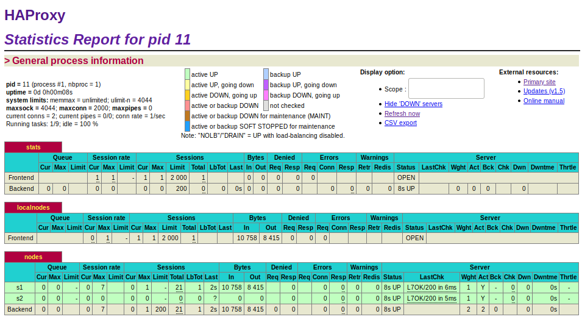
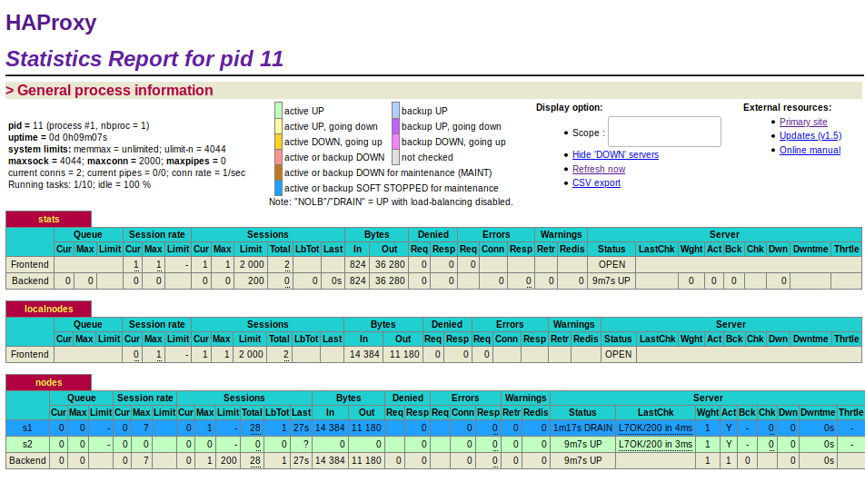
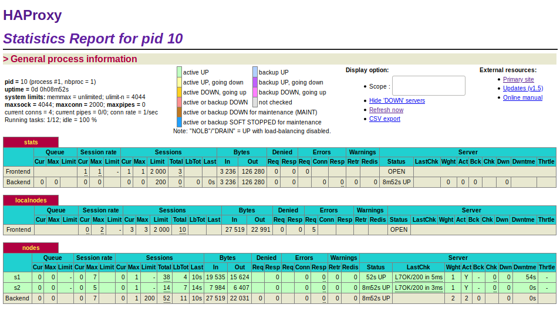
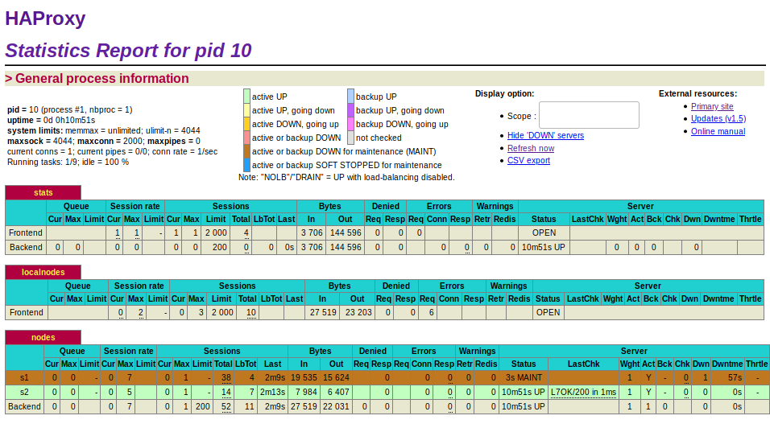

# TASK 3

1. Take a screenshot of the Step 5 and tell us which node is answering.

   

   On peut s'apercevoir que le node s1 est celui qui répond.

2. Based on your previous answer, set the node in DRAIN mode. Take a screenshot of the HAProxy state page.

   

   Le node s1 est passé en bleu maintenant.

3. Refresh your browser and explain what is happening. Tell us if you stay on the same node or not. If yes, why? If no, why?

   Lors du rafraîchissement de la page, on reste toujours sur le même serveur. En effet, tout le trafic qui est déjà dirigé sur le serveur va le rester. Le reste de celui-ci devrait aller sur l'autre serveur.

4. Open another browser and open `http://192.168.42.42`. What is happening?

   La requête est redirigé sur le node s2. C'est le comportement normal du Round robin.

5. Clear the cookies on the new browser and repeat these two steps multiple times. What is happening? Are you reaching the node in DRAIN mode?

   Le serveur s1 n'est jamais atteint en mode DRAIN. En effet, à chaque nouvelle session, le serveur va nous rediriger sur le serveur s2. 

6. Reset the node in READY mode. Repeat the three previous steps and explain what is happening. Provide a screenshot of HAProxy's stats page.

   Le navigateur maintient toujours la connection sur le node s1. Ensuite à l'ouverture d'un nouvelle session, le load balancer va se comporter normalement. Il va switcher entre s1 et s2 à chaque nouvelle session.

   

7. Finally, set the node in MAINT mode. Redo the three same steps and explain what is happening. Provide a screenshot of HAProxy's stats page.

   Toutes les connexions sont directement redirigées sur le serveur s2, même les sessions déjà active sur s1. Le serveur s1 n'est plus jamais atteint tant qu'il est en mode MAINT.

   