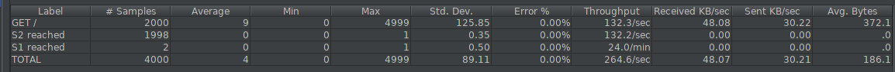

# Task 4

1. Be sure the delay is of 0 milliseconds is set on `s1`. Do a run to have base data to compare with the next experiments.

   Nous avons tout d'abord récuperer l'adresse IP de `s1` avec la commande : 

   `docker inspect s1 | grep IPAddress`    

   Cette commande nous a indiqué que `s1` a comme adresse IP `192.168.42.11`

   Pour mettre le délai à 0 millisecondes, nous avons executé la commande donnée dans l'énoncé : 

   `curl -H "Content-Type: application/json" -X POST -d '{"delay": 0}' http://192.168.42.11:3000/delay`

   Cette commande a bien modifié le délai : 

   

   Nous avons ensuite, comme demandé, executé un JMeter afin d'avoir des données de base : 

   

   Nous pouvons remarquer que les requêtes sont uniformement distrubuées entre les deux serveurs web.

2. Set a delay of 250 milliseconds on `s1`. Relaunch a run with the JMeter script and explain what it is happening?

   Afin de mettre le nouveau délai, nous avons executé la commande :

   `curl -H "Content-Type: application/json" -X POST -d '{"delay": 250}' http://192.168.42.11:3000/delay`

   La commande a bien fonctionné : 

   

   Nous avons relancé les tests et voici les résultats : 

   Nous pouvons remarquer que toutes les requêtes ont bien été effectuées  mais que le délai a un impact majeur sur le serveur `s1`. En effet, dans les résultats précédents (question 1), nous pouvons remarquer que le serveur `s1` a un débit de 127.3/sec mais dans les résultats listés ci-dessus, le débit est descendu à 3.3/sec. Cette baisse est dûe au délai augmenté.

   

3. Set a delay of 2500 milliseconds on `s1`. Same than previous step.

   Afin de mettre le nouveau délai, nous avons executé la commande :

   `curl -H "Content-Type: application/json" -X POST -d '{"delay": 2500}' http://192.168.42.11:3000/delay`

   La commande a bien fonctionné : 

   

   Nous avons relancé les tests et voici les résultats : 

   Nous pouvons remarquer que le délai de 2500 millisecondes à un impact majeur sur le serveur `s1`. En effet, ce dernier ne recevera quasiment plus aucune requête et toutes les requêtes seront redirigées sur le serveur `s2`. Nous nous sommes demandés pourquoi toutes les requêtes étaient redirigées sur le serveur `s2` alors nous nous sommes connectés à l'interface administrative du proxy, situé à l'adresse `http://192.168.42.42:1936/` et nous avons remarqué que le serveur `s1` est considéré par le proxy comme `down` : 

   

   En effet, le proxy le considère comme down si le temps de réponse est beaucoup trop bas.

4. In the two previous steps, are there any error? Why?

   Non, nous n'avons obtenu aucune erreur. En effet, toutes les requêtes ont été effectuées correctement mais durant la deuxième étape, les requêtes ont été majoritairement redirigées sur `s2` car le proxy considerait le serveur `s1` comme n'étant plus disponible. Nous pouvons remarquer également que le `proxy` a bien fait son travail en redirigeant les requêtes sur le serveur 2 en cas d'indisponibilité du serveur 1.

5. Update the HAProxy configuration to add a weight to your nodes. For that, add `weight [1-256]` where the value of weight is between the two values (inclusive). Set `s1` to 2 and `s2` to 1. Redo a run with 250ms delay.

   Nous avons tout d'abord modifié le fichier de configuration `haproxy.cfg` comme ceci : 

   

   Nous avons ensuite éteins l'infrastructure et remonter afin que cette dernière prenne en compte la modification du fichier de configuration.

   Nous avons ensuite définit le nouveau délai de `250ms` sur le serveur `s1` : 

   

   

   Voici les résultats obtenus sur le logiciel `Jmeter` :

   

   Nous pouvons remarquer que le poids n'a eu aucune influence sur la distribution des paquets. En effet, étant donné que les sessions sont toujours preservées, et que nous avons simulé deux utilisateurs faisant chacun 1000 requêtes, ces dernières seront redirigées sur le même serveur. 

   Par contre, si nous mettons une configurations de 3 utilisateurs avec 100 requêtes chacun, nous pouvons remarquer que les requêtes sont distribuées selon le poids :

   

   

6. Now, what happened when the cookies are cleared between each requests and the delay is set to 250ms ? We expect just one or two sentence to summarize your observations of the behavior with/without cookies.

   La configuration du test est de **2 utilisateurs **faisant chacun **100 requêtes**.

   Voici les résultats obtenus avec et sans cookies : 

   **Avec cookies:**

   

   **Sans cookies:**

   

   Nous pouvons remarquer que sans les cookies, les requêtes sont distribuées selon les poids accordés, 2 pour le `s1` et 1 pour le `s2`. Par contre, avec les cookies, les requêtes sont réparties à moitié sur le `s1` et l'autre moitié sur `s2`. Ce comportement est dû au fait que les cookies sont présents et que lorsque le premier utilisateur va se connecter et s'il est redirigé sur le `s1`, toutes ces futures requêtes seront redirigées sur le `s1`, indépendamment du poids. Ce comportement est identique avec le deuxième utilisateur, mais sur `s2`.